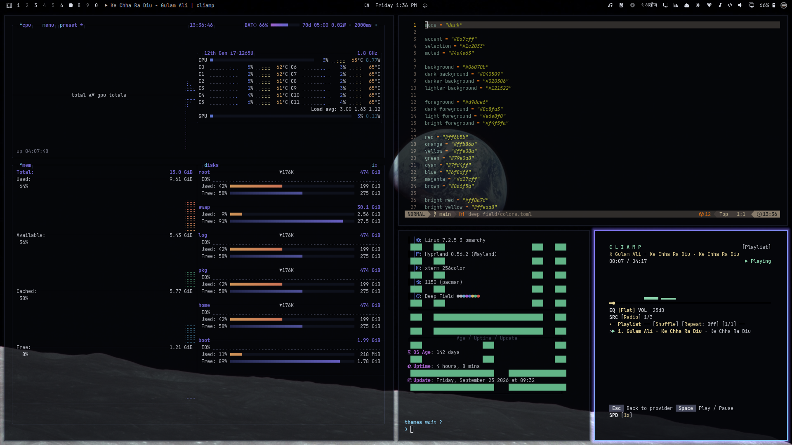

# Deep Field



Vast, cold and silent. Void black and starlight white, with a faint nebula violet and the glow of a distant sun.

## Install

```bash
omarchy theme install https://github.com/sumdahl/omarchy-deep-field-theme
```

## Palette

| Role | Color |
|---|---|
| background | `#06070b` |
| foreground | `#d9dce6` |
| accent | `#8a7cff` |
| red | `#ff6b5b` |
| orange | `#ffb86b` |
| yellow | `#ffe08a` |
| green | `#79e0a8` |
| cyan | `#7fd4ff` |
| blue | `#6f8dff` |
| magenta | `#d27cff` |
| brown | `#8a6f5a` |

## Wallpapers

- `00-earthrise.jpg`: William Anders / NASA, *Earthrise* (AS08-14-2383), Apollo 8, 1968, public domain. Cropped.
- `01-pale-blue-dot.jpg`: NASA/JPL-Caltech, *Pale Blue Dot* (PIA23645, 2020 remaster), Voyager 1, 1990, public domain. Native crop plus an annotation.
- `02-heliosphere.jpg`: original: log-scale orbit chart with Voyager 1's escape path.
- `03-pulsar-map.jpg`: original: after the Voyager Golden Record pulsar map; the binary ticks are decorative, not real pulsar periods.
- `04-southern-ring.jpg`: NASA, ESA, CSA, STScI, *Southern Ring Nebula* (JWST NIRCam, 2022), public domain. Floated on the void with feathered edges.
- `05-pillars-of-creation.jpg`: NASA, ESA, CSA, STScI; J. DePasquale, A. Koekemoer, A. Pagan, *Pillars of Creation* (JWST NIRCam), public domain. Cropped, framed print.
- `06-cosmic-cliffs.jpg`: NASA, ESA, CSA, STScI, via NASA's James Webb Space Telescope Flickr, *Cosmic Cliffs* (NGC 3324), CC BY 2.0. Framed print.
- `07-ultra-deep-field.jpg`: NASA and ESA, *Hubble Ultra Deep Field* (high-res edit), public domain. Cropped.
- `08-webb-first-deep-field.jpg`: NASA, ESA, CSA, STScI, *Webb's First Deep Field* (SMACS 0723), public domain. Framed print.

## License

The theme files are MIT licensed. Each wallpaper keeps the license listed above.
